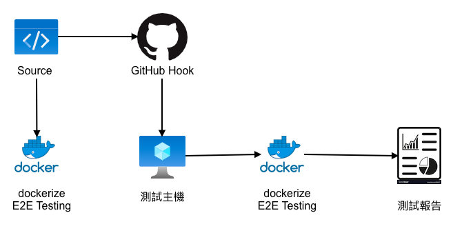

# WebDriverIO+Docker integration

## install environemtn

- node latest LTS
- docker runtime

## init project

make a working folder and init projecdt

```bash
npm init -y
npm i --save-dev @wdio/cli
npx wdio config -y
```

## docker integration

install docker service

```bash
npm install wdio-docker-service --save-dev
```

configuration

```config
// wdio.conf.js
exports.config = {
   // ...
   path: '/wd/hub', // Required to work with wdio v6
   services: ['docker'],
   dockerOptions: {
      image: 'selenium/standalone-chrome',
      healthCheck: 'http://localhost:4444',
      options: {
         p: ['4444:4444'],
         shmSize: '2g'
      }
   },
   // ...
};

// package.json , add test command
"test": "./node_modules/.bin/wdio wdio.conf.js"
```

## run test

```bash
npm run test
```

## reference document

- [https://webdriver.io/docs/docs/wdio-docker-service.html](https://webdriver.io/docs/docs/wdio-docker-service.html)
- [https://github.com/stsvilik/wdio-docker-service/wiki/Selenium-Docker:-Viewing-tests-as-they-run*](https://github.com/stsvilik/wdio-docker-service/wiki/Selenium-Docker:-Viewing-tests-as-they-run)

## E2E Test Flow

